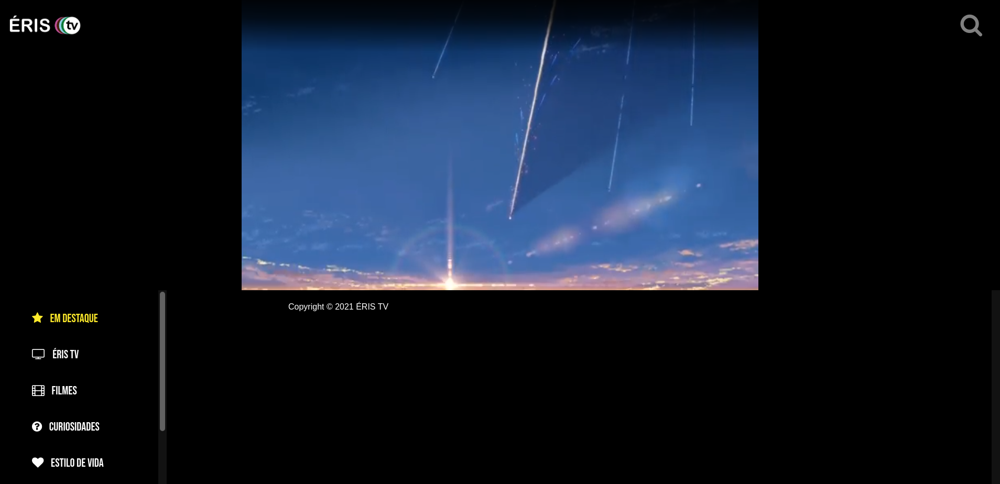

# **ERIS TV**
Apenas um estudo com GraphQL usando Apollo

## **Server**
* Primeiramente Inicie o servidor que contem o GraphQL
```js
node index.js 
```
* O servidor esta configurado para a porta 4001, basta acessar `http://localhost:4001`

## **Client**
```js
npm run serve
```

* O cliente esta configurado na porta 8080, basta acessar `http://localhost:8080`


